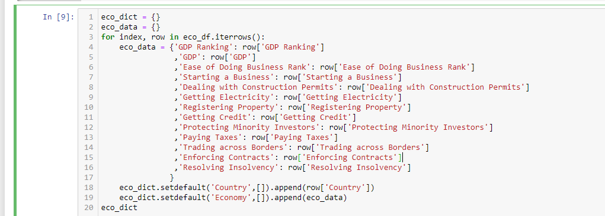
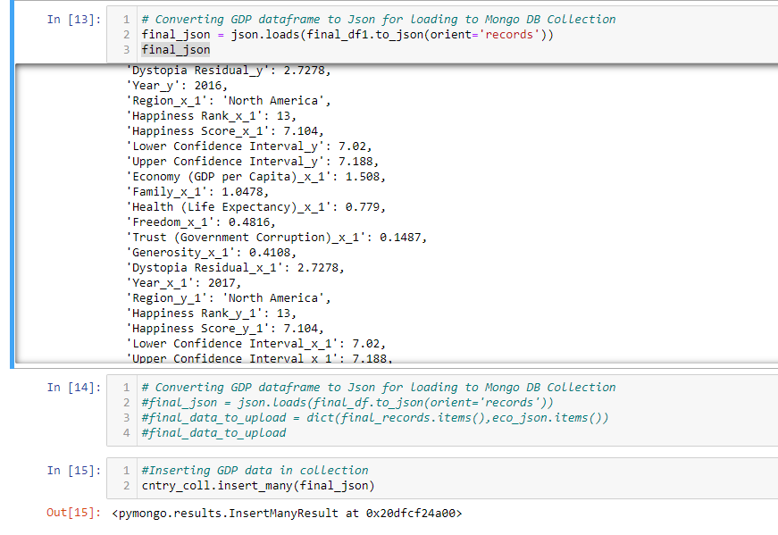
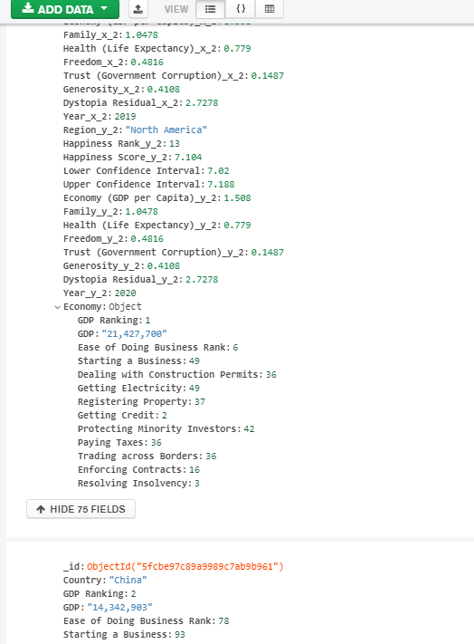

# **ETL Project - Country Info**


### This was done using Jupyter Notebooks and Mongodb. You will need to install and import the following

- Jupyter Notebooks

- pandas 

- numpy

- os

- Mongodb

- json

- sqlalchemy

- pymongo
## Step 1 - Extract Data

The data used was extracted from these sites as CSVs

- https://www.kaggle.com/bitsnpieces/covid19-country-data?select=country_names_covid19_forecast.csv

- https://www.kaggle.com/darknez/gdp-among-world

- https://www.kaggle.com/pradeepp/economy-rankings

- https://datacatalog.worldbank.org/dataset/gdp-ranking

- https://www.kaggle.com/mathurinache/world-happiness-report

## Step 2 - Pull Data into Python

```python
Rankings_file = "Resources/Rankings.csv"
Rankings_df = pd.read_csv(Rankings_file)
```

```python
GDP_file = "Resources/GDP.csv"
GDP_df = pd.read_csv(GDP_file, encoding="ISO-8859-1")
```


```python
Growth_file = "Resources/Growth.csv"
Growth_df = pd.read_csv(Growth_file)
```

```python
h_2015 = pd.read_csv('ETL-Project/Resources/2015.csv',encoding='utf-8')

h_2016 = pd.read_csv('ETL-Project/Resources/2016.csv',encoding='utf-8')

h_2017 = pd.read_csv('ETL-Project/Resources/2016.csv',encoding='utf-8')

h_2018 = pd.read_csv('ETL-Project/Resources/2016.csv',encoding='utf-8')

h_2019 = pd.read_csv('ETL-Project/Resources/2016.csv',encoding='utf-8')

h_2020 = pd.read_csv('ETL-Project/Resources/2016.csv',encoding='utf-8')
```


# Transform

## Step 3 - Data cleaning and filtering 

### Cleaning

```python
GDP_drop = GDP_df.drop(GDP_df.columns[[0,2,5]], axis = 1)
```


```python
GDP_final= GDP_drop.rename(columns={"Ranking": "GDP Ranking",
                                    "Economy": "Country",
                                    "US dollars)": "GDP"}))
GDP_final.set_index("Country", inplace=True)                                    
```


Learned that I could convert df into a series so a drop with a range could be done.

```python
Covid_drop = Covid_df.drop(Covid_df.columns[0,], axis = 1)
Final_Covid_drop = Covid_drop.drop(Covid_drop.columns.to_series()["h1n1_Geographic_spread":"longitude"], axis=1)
```


```python
df['column_name'] = round(df['column_name'],4)
```

### Merging
```python
merge1 = pd.merge(GDP_final,Rankings_final, on = ["Country"])
merge2 = pd.merge(merge1,Growth_final, on = ["Country"])
merge_final = pd.merge(merge2,Health_final, on = ["Country"])
```


```python
data_merge = pd.merge(Final,Covid_final, on = ["Country"])
```


merging on two keys
```python
first_df = pd.merge(h_2015,h_2016, on=['Country','Region'])
second_df = pd.merge(first_df,h_2017, on=['Country','Region'])
third_df = pd.merge(second_df, h_2018, on=['Country','Region'])
fourth_df = pd.merge(third_df, h_2019, on=['Country','Region'])
fifth_df = pd.merge(fourth_df, h_2020, on=['Country','Region'])
```


### Exporting
```python
Final.to_csv("Resources\Mongo_Data.csv")
```

```python
Final_Economy.to_csv("Resources\Economy_Data.csv")
```

## Mongodb
After getting final data in csv formats I imported the data in Pandas.
There were some challenges in data like
1. we have indexed columns which were like "Unnamed : 0. Which had to be removed before upload to Mongo
2. I had to combine Economy Dataset to Final Dataset, to get Economy as a set of values for each countries, rather having each as separate column.
3. Finally converted merged Dataframe to json format and uploaded to Mongo

Key challege
1. Converting a Economy data to a dict to get it as Collection of Colunmns in Mongo DB.
   
2. Merging Final data with column Collection, 1 columns for 13 different columns
   
3. Finally data in Mongo
   

## Unique data and challenges 

- Had to look up and reasurch encoding to get one CSV to import properly.

- Learned that I could convert df into a series so a drop with a range could be done.
